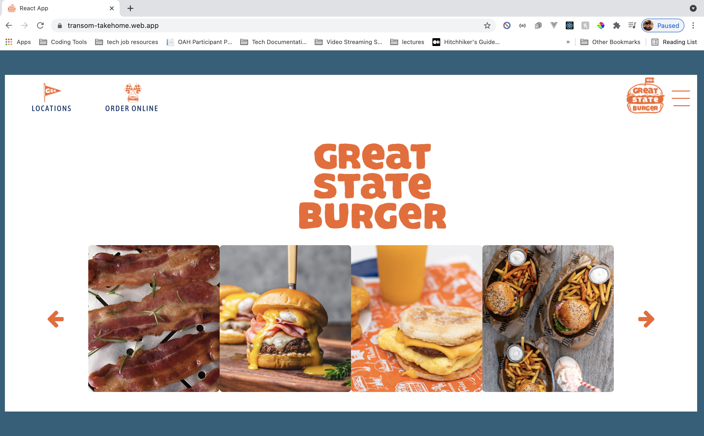
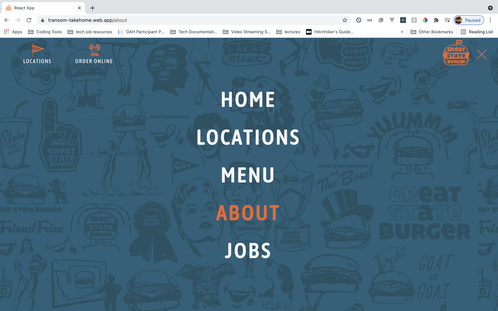

# real-transom-takehome
Built with <b><a href="https://reactjs.org/">React</a></b>, <b><a href="https://reactrouter.com/web/guides/quick-start">react-router-dom</a></b>, <b><a href="https://reactrouter.com/web/guides/quick-start">react-carousel</a></b> and <b><a href="https://sass-lang.com/">SASS</a></b>.

## To get started:

fork and clone this repository
`cd transom`
then 
`npm i`
 then
 `npm start`

## To deploy:
`npm run build` then `firebase deploy`

Project hosted through firebase on https://transom-takehome.web.app/.

